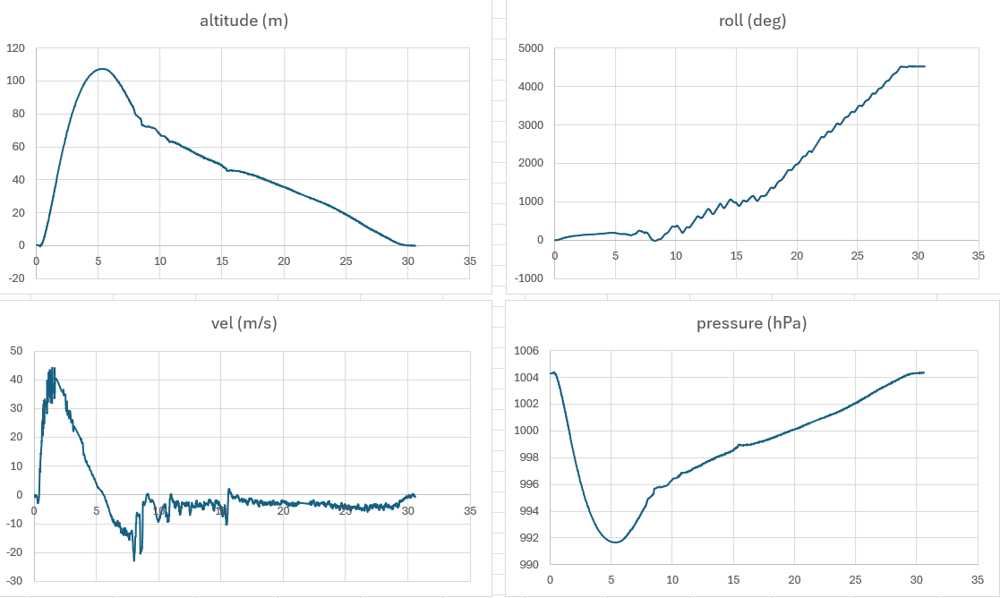
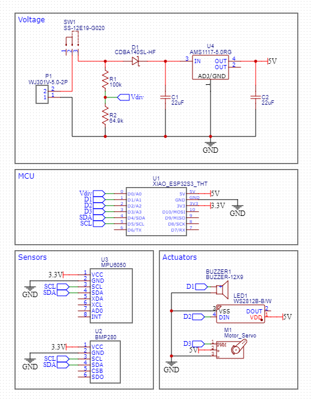

# Triton

I've always enjoyed launching water rockets, but I wanted to learn more about what happens during flight. That's why I built Triton, a simple flight computer based on the Xiao ESP32-S3. Featuring a BMP280 barometer and a MPU6050 IMU, Triton combines data logging to an SD card at 50 Hz, onboard video recording and even automatic parachute deployment, all in one package! This was also my first time designing a PCB so it was definitely a fun project!

## Components List

- Seeed Studio Xiao ESP32-S3 Sense
- BMP280 Barometer
- MPU6050 IMU (I know, not a great pick for a rocket but at least it's dirt cheap)
- OV2640 Camera
- Passive Buzzer
- WS2812B RGB LED
- Servo Motor
- 7.4V 450 mAh Lipo Battery

## SD Card

Triton produces a flight directory for each new flight.
Inside each flight directory, it saves:
- `flight_1.avi`: an AVI video file of the onboard camera footage
- `flight_1.csv`: a CSV file containing flight stats
- `flight_1_lgs.csv`: a CSV file containing flight data logged at ~50 Hz

## Flight Data

## Onboard video

The video produced has a VGA resolution (640x480) at 20 FPS. (This GIF is compressed and is only 10 FPS to reduce the file size)

## Schematic

The flight computer is powered by a 2S Lipo battery (7.4V) with a capacity of 450 mAh, which is enough to keep the system running for about 2 hours. I used a linear voltage regulator to bring the battery voltage down to a stable 5V which is fed to the Xiao ESP32-S3 and the servo motor. The Xiao board integrates a 3.3V regulator.

Two resistors are wired in series to serve as a voltage divider. The values of 100k and 64.9k Ohms have been calculated so that when the battery is fully charged at 8.4V, a 3.3V signal goes to one of the ESP32's analog inputs.

I added a status LED (WS2812B), which only takes 1 digital pin, as well as a passive buzzer for additional feedback.

## PCB Design

## 3D Printed Brackets

